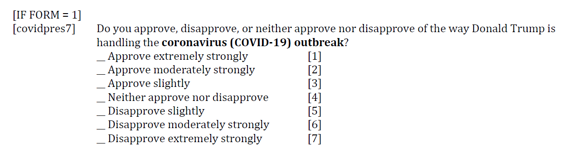
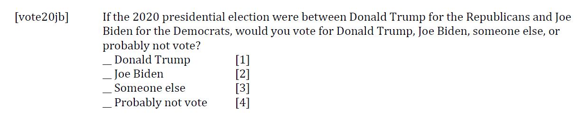
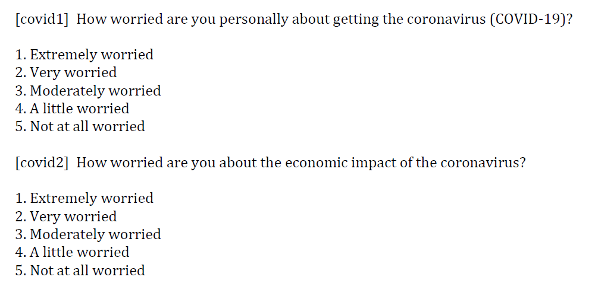
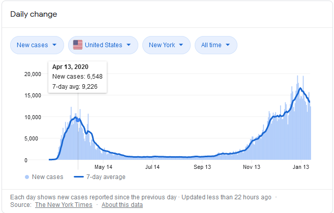

```{r load libraries, warning=FALSE, message=FALSE, include=FALSE}
packages.used<-as.list(
  c("tidyverse",
    "haven",
    "ggplot2"))

check.pkg<-function(x){
  if(!require(x,character.only=T))
    install.packages(x,character.only=T,dependence=T)}

#check if packages needed are installed
lapply(packages.used, check.pkg)

#load packages
library(tidyverse)
library(haven)
library(ggplot2)
```

# Introduction
The year 2020 is an unprecedented year that coronavirus changed the world. While president election caught the eyes all over the world, coronavirus also played an important role during election. Some media believe that Trump's terrible performance in handling coronavirus led him to the lost. In order to confirm that, i conduct an analysis on the 2020 pre-election data.


# About the data
The data is the survey responses of voters in the U.S. collected by the American National Election Studies (ANES). I choose 2020 Exploratory Testing Survey which includes not only the regular question about respondents' attitude on candidates but also their views' on covid-19. Noticed that most of the data was collected through internet instead of face-to-face interview and most of the surveys were happened near mid of april. 

Since there's no direct data showing the relation between covid-19 and lost of election. My project focus on several indirect variables that related to either election or covid-19. The variables i chose can be categorized by four parts: Birth, Covid-19, Trump's performance , and who they vote for.
<!--  import 2020 data -->
```{r read data, warning=FALSE, message=FALSE, include=FALSE}
library(haven)
data2020 <- read_sav("../data/anes_pilot_2020ets_sav/anes_pilot_2020ets_sav.sav")
data2020use <- data2020%>%
  mutate(
    #performance
    covidpres7 = as_factor(covidpres7),
    frnpres7 = as_factor(frnpres7),
    immpres7 = as_factor(immpres7),
    econpres7 = as_factor(econpres7),
    healthcarepres7 = as_factor(healthcarepres7),

    #personal
    birthyr = as_factor(birthyr),
    
    #political trend
    vote20jb = as_factor(vote20jb),
    
    #covid
    covid1 = as_factor(covid1),
    covid2 = as_factor(covid2)
  )
data2020use = data2020use%>%
  select(covidpres7,covid1, covid2, frnpres7,immpres7,econpres7,healthcarepres7,birthyr, educ,inc_anes, vote20jb)
save(data2020, file="../output/data2020.RData")
save(data2020use, file="../output/data2020use.RData")

```


# Analysis & Visualization
To make the process clear, i conduct my analysis by solving three step forward question. 
Question 1: How's Trump performance in handling with covid?
Question 2: How's other factors?
Question 3: How people treat Covid refering to supporting rate?

## Question 1: How's Trump performance in handling with covid?
First I'm curious how respondents view Trumps performance in handling with Covid-19 as well as Trump's support rate before election. Since age could make a differ on opinions, so i also conclude age as a variable. The used survey question is showed below. 


```{r data tydr for p1, warning=FALSE, message=FALSE, include=FALSE}
Q1P1data <- data2020use%>%
mutate(age = fct_collapse(birthyr, teen = as.character(seq(2000,2020)), 
                 adult = as.character(seq(1970,1999)), 
                 old = as.character(seq(1900,1969)))
)%>%
  select(covidpres7, age)%>%
  filter(covidpres7 != "88. NA: Form 2")%>%
  group_by(age)%>%
  count(covidpres7)%>%
  mutate(prop=n/sum(n))

Q1P2data <- data2020use%>%
mutate(age = fct_collapse(birthyr, teen = as.character(seq(2000,2020)), 
                 adult = as.character(seq(1970,1999)), 
                 old = as.character(seq(1900,1969)))
)%>%
  select(vote20jb, age)%>%
  group_by(age)%>%
  count(vote20jb)%>%
  mutate(prop=n/sum(n))
save(Q1P1data, file="../output/Q1P1data.RData")
save(Q1P2data, file="../output/Q1P2data.RData")
```
```{r data visualization for p1_1, warning=FALSE, message=FALSE, echo=FALSE}

ggplot(Q1P1data, aes(x=age, y = prop, fill = covidpres7))+
  geom_bar(stat="identity", colour="black")+
  theme(axis.text.x = element_text(angle = 90))+
  theme_bw()+
  labs(title="Rate how Trump handling Covid-19 outbreak")
```
From the plot, without considering degree of opinion, we could see that the rates are fair among people. However, the proportion of people who extremely strongly disapprove Trump's performance is larger than who extremely strongly approve. Upon this, the public opinion is negative on this problem. 
```{r data visualization for p1_2, warning=FALSE, message=FALSE, echo=FALSE}
ggplot(Q1P2data, aes(x=age, y = prop, fill = vote20jb))+
  geom_bar(stat="identity", colour="black")+
  theme(axis.text.x = element_text(angle = 90))+
  theme_bw()+
  labs(title="Who you will vote in 2020 President Election?")

```
This is a typical question before election to investage each candidate's support rate. From the graph, Trump is a little behind Biden in all three groups.
Noticed that elder people have higher voting rate to either Trump or Biden than adults, while they had higher rate of disapprovement on Trump. This could be a inducement of Trump's lose. 
Overall, people had bad impression on Trump's actions on Covid-19 while Trump had a lower supporting rate. However, the lower supporting rate may contributed by different reasons,probably not mainly from Covid-19. So this lead to Question 2.


## Question 2: How's other factors?
The survey question on five specific aspects of how Trump did, included Covid-19, economic, global fairs, healthcare and immigration. 
```{r data tydr for p2, warning=FALSE, message=FALSE, include=FALSE}
Q2data <- data2020use%>%
  select(covidpres7,frnpres7,immpres7,econpres7,healthcarepres7)%>%
  rename(covid = covidpres7, global = frnpres7, immigration = immpres7, economic = econpres7, healthcare = healthcarepres7)%>%
  pivot_longer(c('covid','global','immigration','economic','healthcare'),names_to = "reason", values_to = "rate")%>%
  filter(rate != "88. NA: Form 2" & rate!= "99. Missing" & rate!= "77. NA: Form 1")%>%
  group_by(reason)%>%
  count(rate)%>%
  mutate(prop=n/sum(n))
save(Q2data, file="../output/Q2data.RData")
```
```{r data visualization for p2, warning=FALSE, message=FALSE, echo=FALSE}
ggplot(Q2data, aes(x=reason, y = prop, fill = rate))+
  geom_bar(stat="identity", colour="black")+
  theme(axis.text.x = element_text(angle = 90))+
  theme_bw()+
  labs(title="How's Trump performance viewed from different factors?")

```
Respondents approve Trump's performance on economic, while disagree on dealing with healthcare and Covid-19. Refer to Trump's supporting rate, i do believe that Covid-19 had a large effect on his support rate. In order to make this conclusion more solid, i further check the relation between supporting rate of two candidates and people's concerns about Covids. 

## Question 3: How people treat Covid refering to supporting rate?

```{r data tydr for p3, warning=FALSE, message=FALSE, include=FALSE}
Q3P1data <- data2020use%>%
  select(vote20jb,covid1)%>%
  filter(vote20jb == "1. Donald Trump" | vote20jb == "2. Joe Biden")%>%
  filter(covid1 != "9. Missing")%>%
  group_by(vote20jb)%>%
  count(covid1)%>%
  mutate(prop=n/sum(n))
  
Q3P2data <- data2020use%>%
  select(vote20jb,covid2)%>%
  filter(vote20jb == "1. Donald Trump" | vote20jb == "2. Joe Biden")%>%
  filter(covid2 != "9. Missing")%>%
  group_by(vote20jb)%>%
  count(covid2)%>%
  mutate(prop=n/sum(n))
save(Q3P1data, file="../output/Q3P1data.RData")
save(Q3P2data, file="../output/Q3P2data.RData")
```
```{r data visualization for p3, warning=FALSE, message=FALSE, echo=FALSE}
ggplot(Q3P1data, aes(x=vote20jb, y = prop, fill = covid1))+
  geom_bar(stat="identity", colour="black")+
  theme_bw()+
  labs(title="How people worried about getting Covid?")

ggplot(Q3P2data, aes(x=vote20jb, y = prop, fill = covid2))+
  geom_bar(stat="identity", colour="black")+
  theme_bw()+
  labs(title="How people worried about the economic impact of the Covid?")

```
In general,the graphs show that most respondents are worried of getting Covid-19 and the economic impact of it. Noticed that more percentage of people, who have higher degree of concern on Covid-19, willing to vote for Biden. This analysis result, which reflect the components of supporting rates, means that more people expected on Biden to deal with Coronavirus than Trump.  


# Limitation
1. Testing way

Due to coronavirus, almost all of the respondents finish the survey through the web instead of face-to-face interview. Due to time consuming, they might not treat the survey seriously thus lead to the basis. 




2. Date of the surveys

Since most of the data is collected at the middle of april while Coronavirus cases just reached its peak. Respondents might not foresee the post impact from such a large number of cases which may lead to a basis. Moreover, the election debate, which might largely flip people's opinions, was in the October. The data would be more reliable if survey dates are close to the election date. 

# Conclusion
In short, Covid-19 did a negative effect on Trump's supporting rate and is a part of reason on Trump's lose. In this project, I reach the conclusion by checking people's opinions on Covid-19 as well as other aspects. Then check the effect of Covid-19 by compared with other aspects. However, Voting decision is composed by many aspects that's hard to predict. The result could be more significant with more data that collecting close to election and including more specific question on Covid-19. 
